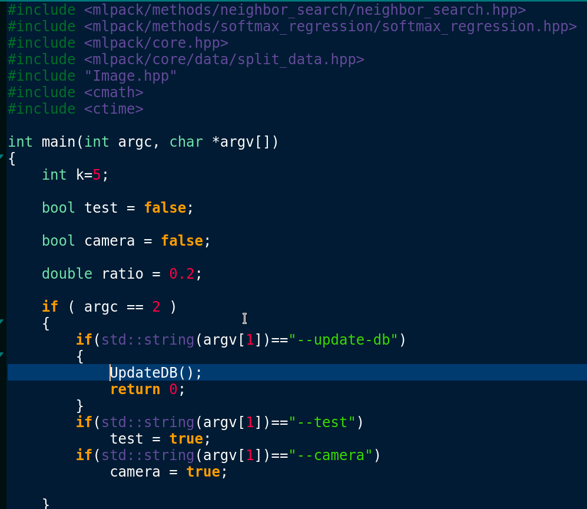
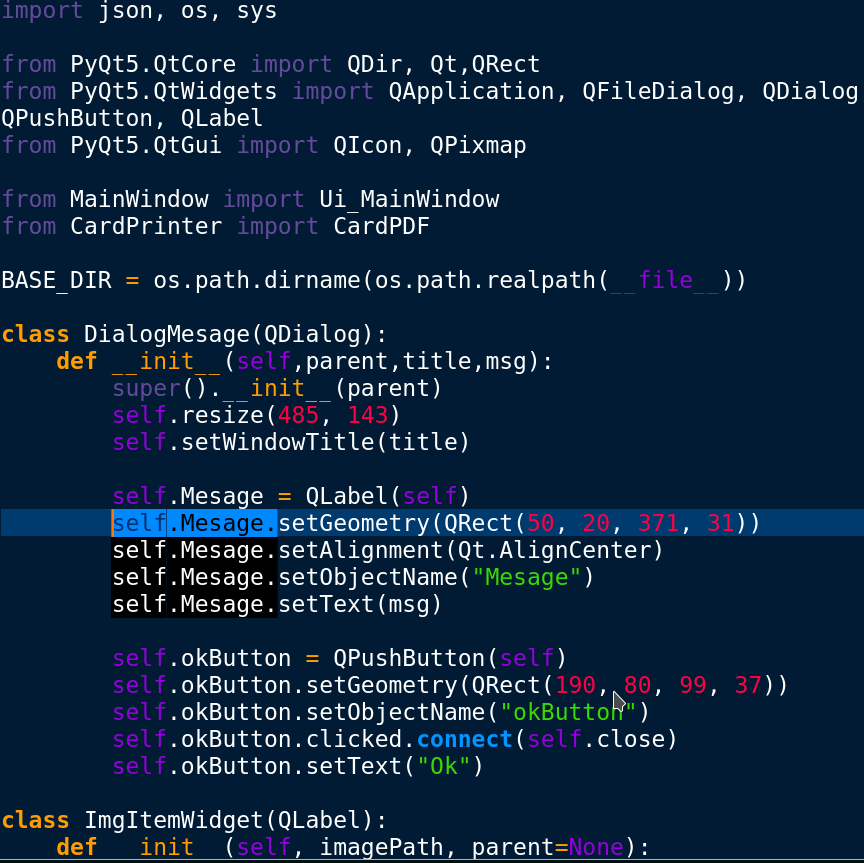

# KateCobaltSyntax
The cobalt syntax theme from gedit ported to kate in .kateschema format
(Just beacause I like it)

## Preview
### Cpp

### Python

## Install

* Import through editor:
Preferences-> Configure Kate -> Fonts & Colors -> Import
